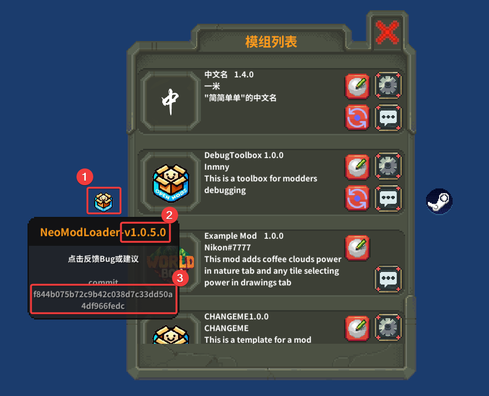
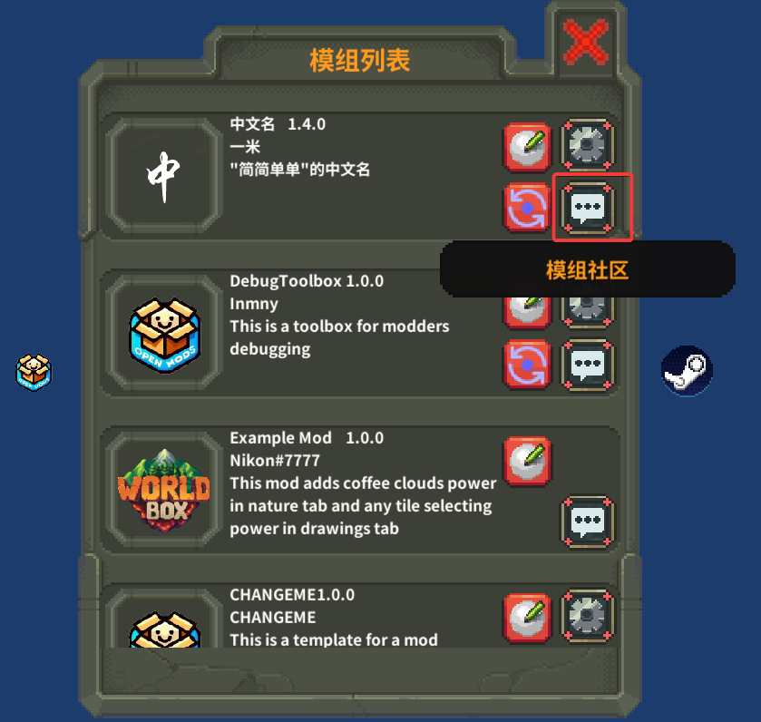

# 模组开关

打开模组列表后, 点击模组的图标即可启用/禁用模组, 部分模组可以点击立即生效, 否则, 需要重启游戏后才会生效.

# 模组状态

1. 当模组的图标呈正常颜色, 则为正常加载
2. 当模组的图标呈灰色, 则表示被禁用
3. 当模组的图标呈红色, 则表示在加载时出现了问题

# 模组设置

部分模组右侧会有模组设置的按钮, 能够修改模组提供的一些设置选项.

# Bug反馈/提出建议

出现问题模组不加载等先看[🐴 注意事项](./Attention.md), 不看还问那就没了.

## NeoModLoader

访问[ISSUE](https://github.com/WorldBoxOpenMods/ModLoader/issues/new?assignees=&labels=bug&projects=&template=bug-report-zh.yaml&title=%5BBug%5D%3A+)反馈Bug

其中NeoModLoader版本号以及commit获取方式:

将鼠标移到点1. 点2所示即为版本号, 点3所示即为commit

## 其他模组

点击该按钮前往反馈, 如果跳转到https://github.com/WorldBoxOpenMods, 则该模组未提供相关页面或网址.

