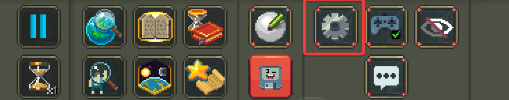
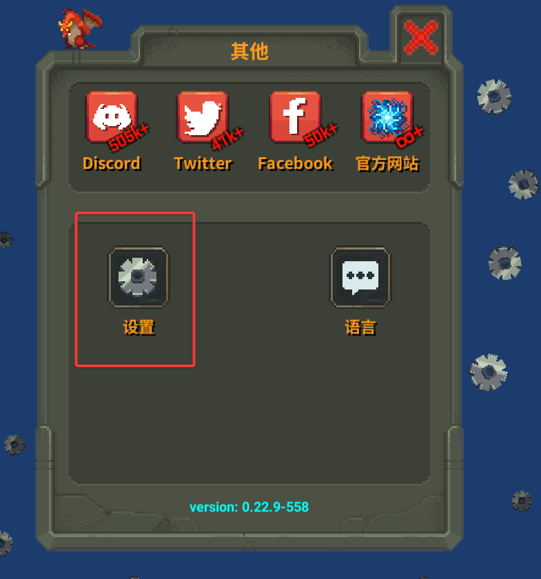
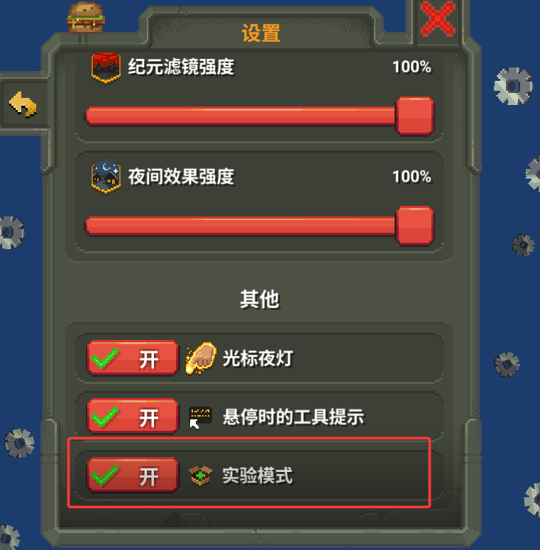
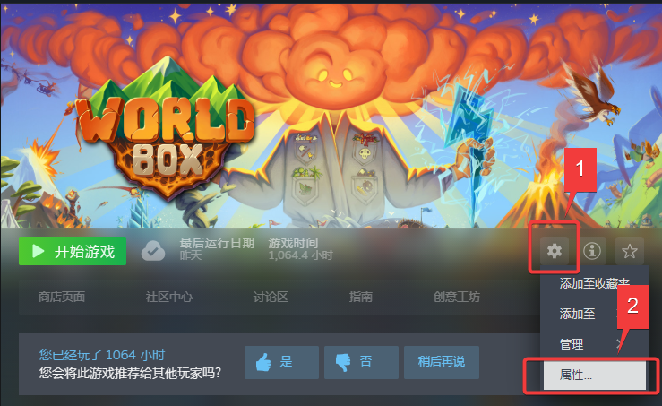
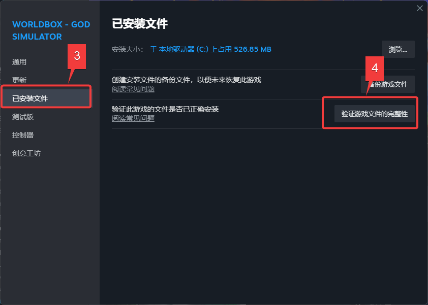
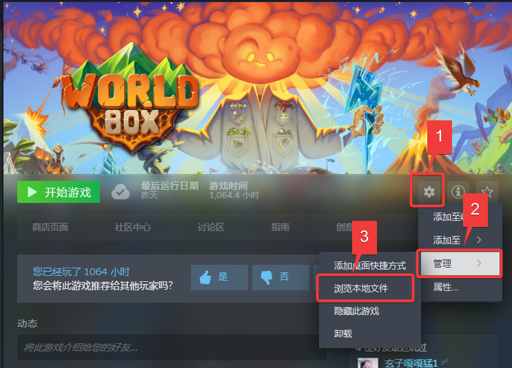
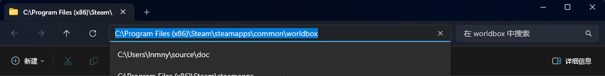
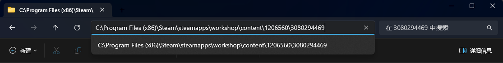

有几种不同的安装方案, 殊途同归, 最后推荐订阅创意工坊中的NML(能够接收创意工坊的自动更新)

由于这个模组加载器是民间自制的, 所以没有Maxim的支持, 从创意工坊订阅后并不能自动被游戏加载.

# 预先准备

模组加载需要开启实验模式.

启动游戏, 

# 下载方式

这里有几种不同的下载NML本体的方式

## 从创意工坊订阅

从该页面订阅 [NeoModLoader创意工坊页面](https://steamcommunity.com/sharedfiles/filedetails/?id=3080294469)

等待下载完成

# 找到下载的NML本体

## 来自创意工坊

地址栏改为(仅修改`common\worldbox`->`workshop\content\1206560\3080294469`)

## 来自其他途径下载

下到哪你自己清楚, 如果是压缩包, 那就解压.

# 拷贝文件

打开游戏文件夹

将刚刚找到的NML本体中的`NeoModLoader.dll`(和可选的`NeoModLoader.pdb`)复制到`worldbox_Data\StreamingAssets\mods`文件夹下