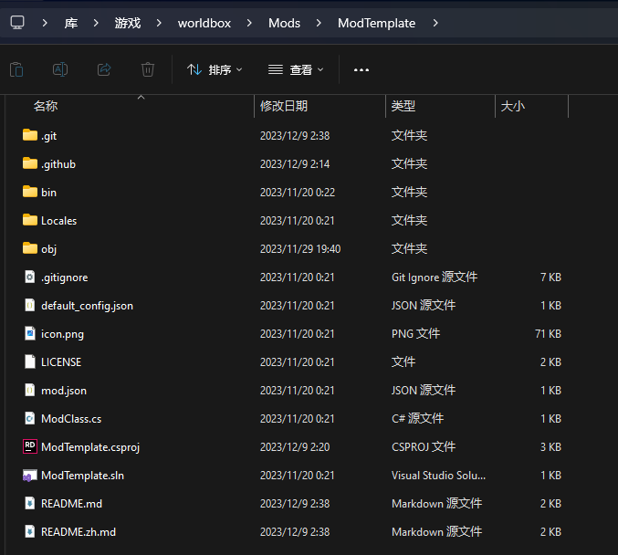

# 两个可选项:

1. 从Mod模板创建
2. 从空文件夹创建

# 从Mod模板创建

如果你会使用Git并且有配置SSH Key后的Github的话, 在`GamePath/Mods`下执行即可

```shell
git clone git@github.com:WorldBoxOpenMods/ModTemplate.git 模组名
```

如果你不会的话, 下载[压缩包](https://github.com/WorldBoxOpenMods/ModTemplate/archive/refs/heads/master.zip), 并解压到`GamePath/Mods`文件夹下

应该得到类似于这样的文件夹结构, 注意目录

<figure><figcaption></figcaption></figure>

有几个文件必须要修改

1. `mod.json` 将"name"的值改为模组名, "author"的值改为作者名
2. `ModClass.cs` 将"CHANGEME"改为你的模组的命名空间, 尽量保证不要和别的模组重复

然后在`ModClass.cs`文件中的`OnModLoad`函数中初始化你的模组. `BasicMod`继承自`MonoBehaviour`, 你可以实现`MonoBehaviour`所有其他的函数. 

# 从空文件夹创建

在`GamePath/Mods`文件夹下创建一个文件夹, 在里面放一个下面所示的`mod.json`和`Main.cs`文件, 其中的中文均需要修改

```json
// mod.json
{
    "name": "模组名",
    "author": "作者名",
    "version": "版本号",
    "description": "模组描述"
}
```

```csharp
// Main.cs
using UnityEngine;
using NeoModLoader.api;
using NeoModLoader.services;
namespace 命名空间名;

public class ModClass : IMod, MonoBehaviour
{
    private ModDeclare _declare;
    private GameObject _gameObject;
    
    public ModDeclare GetDeclaration()
    {
        return _declare;
    }
    public GameObject GetGameObject()
    {
        return _gameObject;
    }
    public string GetUrl()
    {
        return "你模组的网站URL, 没有的话可以填仓库URL, 也可以填创意工坊物品页面, 也可以乱填";
    }
    public void OnLoad(ModDeclare pModDecl, GameObject pGameObject)
    {
        _declare = pModDecl;
        _gameObject = pGameObject;
        // 加载你的模组内容, 这个函数的调用甚至早于第一次Awake
        // OnLoad -> Awake -> OnEnable -> Start -> Update
        LogService.LogInfo($"[{pModDecl.Name}]: Hello World!");
    }
}
```

到这里一个最简单的模组已经完成.

# 注意

对于一个实现`IMod`的模组(包括继承了`BasicMod`的模组), 函数调用顺序会是`OnLoad`(`OnModLoad`)->`Awake`->`OnEnable`->`Start`->`Update`->`Update`->...->`Update`

# 加载运行模组

如果没有出错的话, 应该能够在游戏控制台里找到

```log
[NML]: [模组名]: Hello World!
```

除此之外, 在NML的模组列表里也应该能够找到你的模组